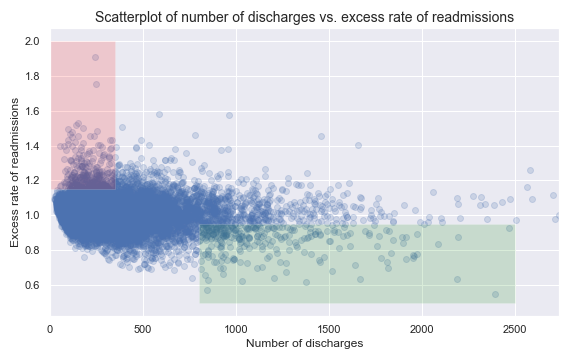
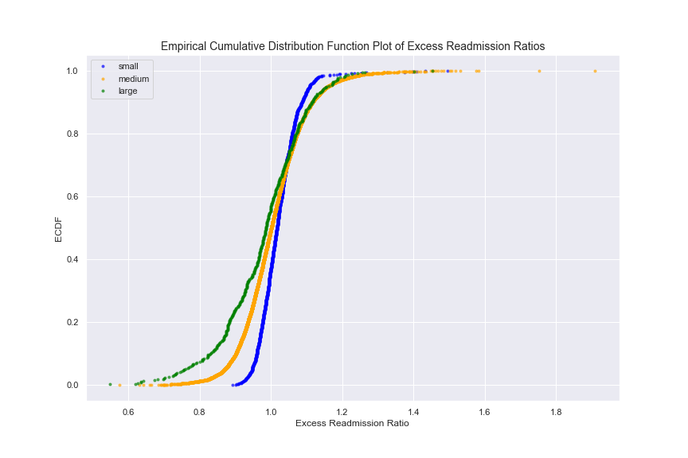
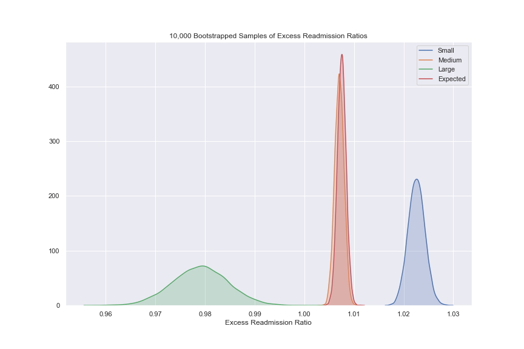

# Hospital Readmissions Data Analysis and Recommendations for Reduction

### Background
In October 2012, the US government's Center for Medicare and Medicaid Services (CMS) began reducing Medicare payments for Inpatient Prospective Payment System hospitals with excess readmissions. Excess readmissions are measured by a ratio, by dividing a hospital’s number of “predicted” 30-day readmissions for heart attack, heart failure, and pneumonia by the number that would be “expected,” based on an average hospital with similar patients. A ratio greater than 1 indicates excess readmissions.

### Exercise Directions

In this exercise, you will:
+ critique a preliminary analysis of readmissions data and recommendations (provided below) for reducing the readmissions rate
+ construct a statistically sound analysis and make recommendations of your own 

## Preliminary Report

Read the following results/report. While you are reading it, think about if the conclusions are correct, incorrect, misleading or unfounded. Think about what you would change or what additional analyses you would perform.

**A. Initial observations based on the plot above**
+ Overall, rate of readmissions is trending down with increasing number of discharges
+ With lower number of discharges, there is a greater incidence of excess rate of readmissions (area shaded red)
+ With higher number of discharges, there is a greater incidence of lower rates of readmissions (area shaded green) 

**B. Statistics**
+ In hospitals/facilities with number of discharges < 100, mean excess readmission rate is 1.023 and 63% have excess readmission rate greater than 1 
+ In hospitals/facilities with number of discharges > 1000, mean excess readmission rate is 0.978 and 44% have excess readmission rate greater than 1 

**C. Conclusions**
+ There is a significant correlation between hospital capacity (number of discharges) and readmission rates. 
+ Smaller hospitals/facilities may be lacking necessary resources to ensure quality care and prevent complications that lead to readmissions.

**D. Regulatory policy recommendations**
+ Hospitals/facilties with small capacity (< 300) should be required to demonstrate upgraded resource allocation for quality care to continue operation.
+ Directives and incentives should be provided for consolidation of hospitals and facilities to have a smaller number of them with higher capacity and number of discharges.

## Analysis

| Facility Size | Mean Excess Readmission Ratio | % with Excess Readmission Ratio Greater than 1 |
| ------------- | ----------------------------- | ---------------------------------------------- |
| All           | 1.008                         | 51.66                                          |
| Small         | 1.023                         | 63.22                                          |
| Large         | 0.979                         | 44.57                                          |

### Setup an appropriate hypothesis test
**H0**: There is no relationship between number of discharges and excess readmission ratios. 
$\alpha$ = 0.01

First, we will test this hypothesis by examining if there is a significant difference in the means of facilities with large and small number of discharges as compared to the sample mean.

We will then test the hypothesis with a second method by using a regression line and Pearson's r to examine if there is a linear relationship bewteen the number of discharges and excess readmission ratios. We wil then use pairs bootstrap to test the null hypothesis. To get a slightly different look at the data, we create a scatter plot with the estimated small and large facilities highlighted. Small facilities were defined by those with less than 100 discharges, while large facilities are those with over 1000 discharges. The number of discharges were chosen based on sampling different groups and determining their mean excess readmission ratios. These groups seemed to have the highest and lowest readmission ratios. We also plot the sample mean and two standard deviations, as well as the mean for each of the two subgroups. The middle group has been diluted in an attempt to help reduce visual confusion.

We can plot the empirical cumulative distributions functions of each groups to see that they do all seem to be normally distributed with slightly different means and variances.

### Bootstrap Analysis
A bootstrap analysis is performed by calculating 10,000 mean excess readmission ratios using resampled data from each group. We can see in the distribution plot below that the group means really tighten up and separate from one another.

The following table shows z-score and p-value of the calculcated mean excess readmission ration assuming the null hypothesis. This is calculated for each group using the sample and bootstrap data. 

| Data Source | Facility Size | z-score | p-value |
| ----------- | ------------- | ------- | ------- |
| Sample      | small         | 0.1640  | 0.5652  |
|             | large         | -0.3097 | 0.3784  |
| Bootstrap   | small         | 1898.95 | 0.0000  |
|             | large         | -3578.11| 0.0000  |

On average, the small and large facilities have a difference in excess readmission ratios of 0.0435. This gives us a Cohen's d value of 0.5445, implying that the number or discharges (or approximate facility size) seems to have a moderate effect on the excess readmission ratio.

A pairs bootstrap analysis may provide further insight into the correlation between excess readmission and facility size. For this analysis, 10,000 sample means were calculated for slope, Pearson r, and r2. Their means and confidence intervals are as follows:

| Statistics    | Mean     | 99% Confidence Interval |
| ------------- | -------- | ----------------------- |
| Slope         | -0.00003 | (-0.00004,-0.00002)     |
| Pearson r     | -0.09285 | (-0.12250,-0.06398)     |
| r2 | 0.00881  | (0.00409, 0.01501)      |

### Report statistical significance for  𝛼  = .01.
The p-value was computed for two statistics using three methods in order to examine the validity of the null hypothesis. We start by examining the diffference of mean excess readmission rates of small and large facilities compared to the sample mean. For the mean of small facilities, we find a p-value of 0.5652, and 0.3784 for large facilities. Both of these probabilities fall well above our significance value of 0.1. Therefore we fail to reject the null hypothesis.

However, if we use the sample to create 10,000 bootstrap samples, we can see that while our subgroup means don't change, they become more tightly defined and lose a lot of the variance within each group. The p-values for the bootstrap samples of small and large facilities now both fall below 0.0000. Using bootstrap statistics, we would now reject the null hypothesis that there is no difference in the means excess readmission rate of large and small facilities.

For the second method, we can use Cohen's d tto estimate the effect size of the difference in means between small and large facilities. On average, there is a difference in excess readmission ratios of 0.0435 (d = 0.5445). This implies that there is a moderate effect in the difference. This does not help us to reject or fail to reject the null hypothesis, but it does give us enough evidence to move forward with the belief that we may reject the null hypothesis.

Finally, we can use a pairs bootstrap linear regression to test the null hypothesis using the correlation coeffecient. The sample data provides a Pearson's r of -0.0931, indicating a slightly negative correlation between increasing size and increasing excess readmission rates. If the null hypothesis is true, then we would expect to see the coefficient to be equal to 0.0 somewhere in our 99% confidence interval. To test this, we use the sample data to create 10,000 bootstrap samples of slope and Pearson's r. Doing so, we find 99% confidence intervals for the slope between -0.00004 and -0.00002 and for Pearson's r between -0.12250 and -0.06398. Although these are not strong correlation markers, we must reject the null hypothesis since neither contain 0.0. If we use the bootstrap statistics to calculate r², we get a confidence interval between 0.00409 and 0.01501, which can be interpreted to mean that between 0.4% and 1.5% of the variability in excess readmission ratios can be explained by the number of discharges (or rough estimate of facility size). 

### Discuss statistical significance and practical significance. Do they differ here? How does this change your recommendation to the client?
While the tests rejecting the null hypothesis are statistically significant, this does not mean that they are practically significant. The r² and Cohen's d values indicate that the number of discharges has a small effect on the variability in excess readmission ratios. As recommended, it may be worth requiring smaller facilities to demonstrate upgraded resource allocation in order to improve their excess readmission ratios. However, further research should be done to find additional covariants that are contributing to the variance in excess readmissions rates. Directives and incentives made to hospitals should be tested for effectiveness.

However, the call to consolidate smaller hospitals does not seem practical as this may drastically increase the travel time for patients. Doing could have negative implications on patient access to healthcare and health outcomes. Given the small effect size of the number of discharges, it seems more likely that other covariants may be more highly correlated excess readmissions ratios.

### Look at the scatterplot above.
* What are the advantages and disadvantages of using this plot to convey information?
* Construct another plot that conveys the same information in a more direct manner.

The benefits of this scatter plot are that it allows the viewer to see the areas where the excess readmissions ratios are abnormally high or low in relation to the number of discharges. The problem is that highlighting these two area may give a false impression of the intensity of the linear relationship between these two variables. Furthermore, there are so many points clustering around the mean that they get lost, possibly giving a false sense of the impact of the relatively few cases outside of the norm. 

A similar plot that may be slightly less deceiving is the scatterplot above that segments the datapoints by size and provides their respect means. With this plot you can see that there does appear to be a slight difference in the means without overstating the difference. 

Another scatter plot that is useful in showing the linear relationship (albeit slight) is the bootstrap plot above. This gives a stronger sense of the relationship by showing the 99% confidence interval of the regression line. 

### Resources
+ Data source: https://data.medicare.gov/Hospital-Compare/Hospital-Readmission-Reduction/9n3s-kdb3
+ More information: http://www.cms.gov/Medicare/medicare-fee-for-service-payment/acuteinpatientPPS/readmissions-reduction-program.html
+ Markdown syntax: http://nestacms.com/docs/creating-content/markdown-cheat-sheet
****