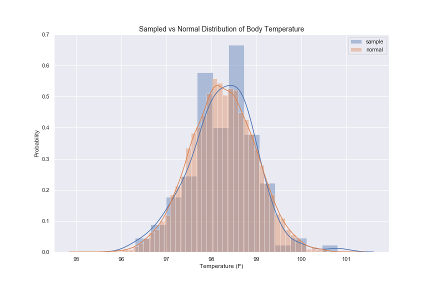
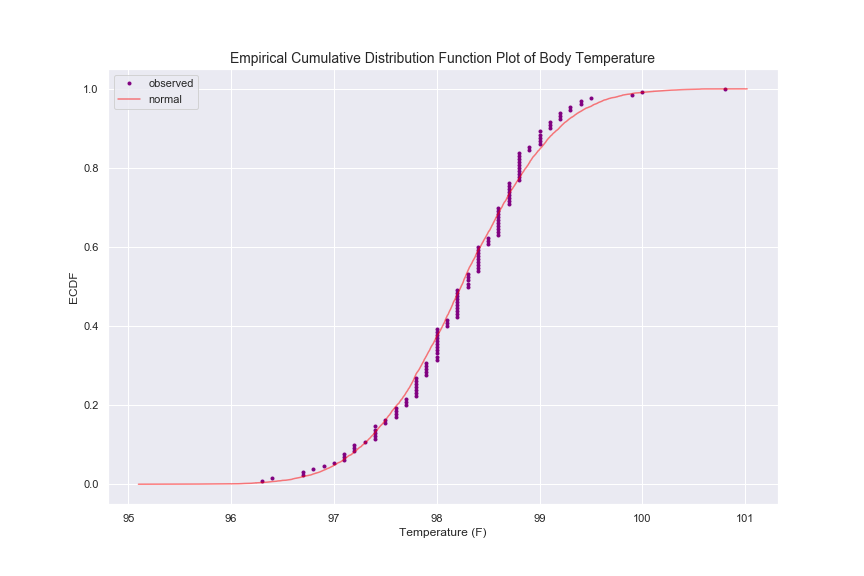
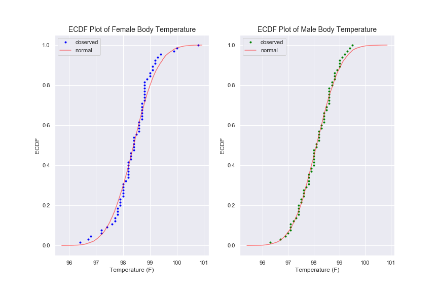
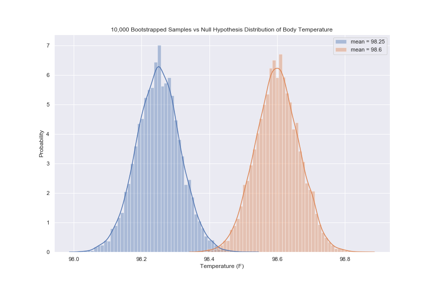
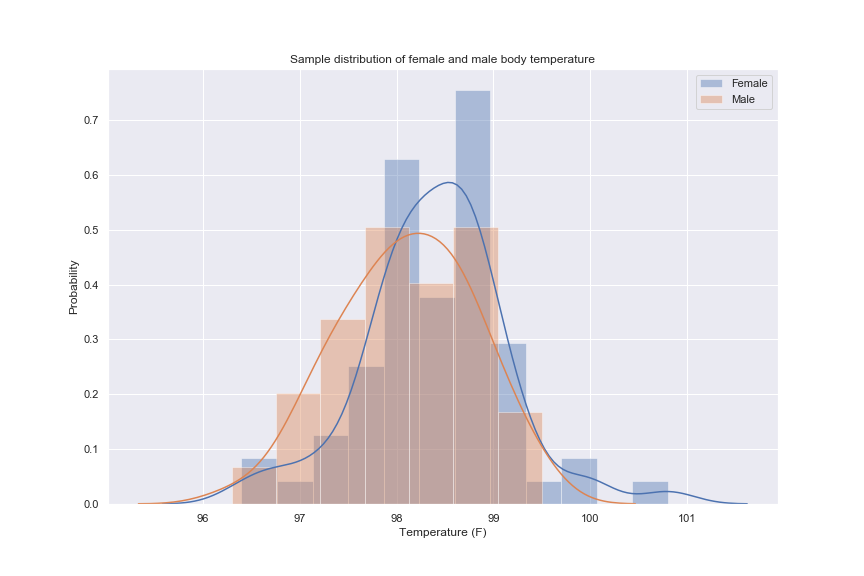
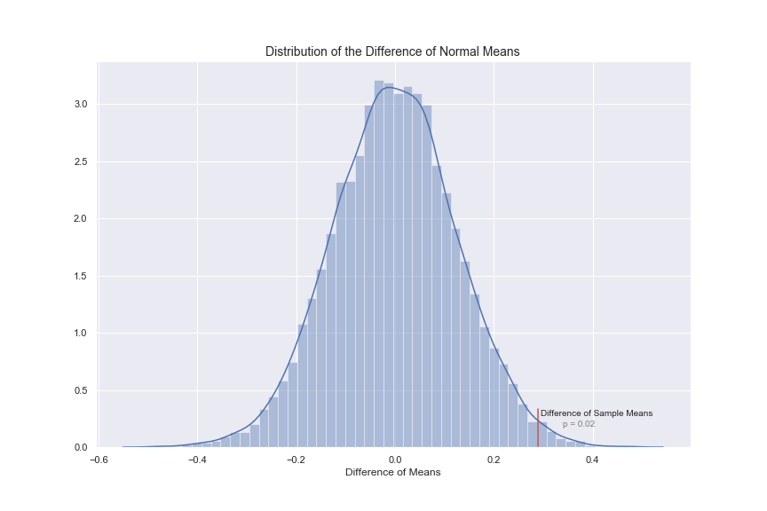

# What is the True Normal Human Body Temperature?

## Background
The mean normal body temperature was held to be 37o C or 98.6o F for more than 120 years since it was first conceptualized and reported by Carl Wunderlich in a famous 1868 book. But, is this value statistically correct? In this exercise, we will examine [a dataset from the Journal of Statistics Education](https://ww2.amstat.org/publications/jse/jse_data_archive.htm) to estimate the true normal human body temperature.

## Describing the Data

<table style="width:100%">
  <tr>
    <th  class="verticalSplit" style="border-bottom:1px solid gray">Total Population</th>
    <th  class="verticalSplit" style="border-bottom:1px solid gray">Female Population</th> 
    <th  class="verticalSplit" style="border-bottom:1px solid gray">Male Population</th>
  </tr>
  <tr>
    <td  class="verticalSplit">Sample Mean: 98.25o</td>
    <td  class="verticalSplit">Sample Mean: 98.39o</td> 
    <td  class="verticalSplit">Sample Mean: 98.10o</td>
  </tr>
  <tr>
    <td  class="verticalSplit">Sample Standard Deviation: 0.73</td>
    <td  class="verticalSplit">Sample Standard Deviation: 0.74</td> 
    <td  class="verticalSplit">Sample Standard Deviation: 0.69</td>
  </tr>
  <tr>
    <td  class="verticalSplit" style="border-bottom:1px solid gray">Population Count: 130</td>
    <td  class="verticalSplit" style="border-bottom:1px solid gray">Population Count: 65</td> 
    <td  class="verticalSplit" style="border-bottom:1px solid gray">Population Count: 65</td>
  </tr>
</table>

Although none of the sample means are equal to assumed mean of 98.6o, the assumed mean is within one standard deviation for each population. To further examine the true population mean, we will first need to make sure that our sample abides by certain assumptions and conditions:

1. Random sample condition
    * it is assumed that every member of the true population had an equal chance at being sampled
1. Independence assumption
    * the value of one data point should not influence the value of following data points in this set
1. 10% condition
    * the sample is much less than 10% of the total population and therefore we do not need to worry about sampling without replacement
1. Sample size assumption
    * we will examine this after we have observed the approximate distribution 
1. Approximately normal distribution
    * we will look at the distribution graphically and quantitatively

### Is the sample data normally distributed?
We would assume the data to be normally distributed with a potentially right-tailed distribution to account for pyrexia (fever). Plotting the sample data probability density function (PDF) against a normal distribution shows that the data is fairly normally distributed.



To get a clearer picture, we can compare the sample empirical cumulative distribution function (ECDF) to the normal ECDF and see that the data still appears to be normally distributed with a potential variation above the median.




This remains true if we plot the ECDF of the female and male populations.



For a quantitative analysis of normality, we will use the `stats.normaltest` method, which tests whether a sample differs from a normal distribution using D’Agostino and Pearson’s test [[link for more info](https://docs.scipy.org/doc/scipy/reference/generated/scipy.stats.normaltest.html)].  If we set our null hypothesis (H0) to be that the sample data is normally distributed and set our significance level at 0.05, we draw the following conclusions:


    

        <b>All Temperature Data</b>: p = 0.259 
        <b>Female Temperature Data</b>: p = 0.094 
        <b>Male Temperature Data</b>: p = 0.640 
    



For each of these, the null hypothesis cannot be rejected, so we can assume that the sample data is normally distributed. Back to the question of a sufficiently sized sample, we can assume that because the data is normally distributed, not skewed, and unimodal, that our sample size of 130 is large enough to apply the Central Limit Theorem.  

## Is the true population mean 98.6 degrees F?
To answer this we will first set up our hypothesis parameters to examine the difference between a bootstrap sample mean and the proposed population mean of 98.6oF in order to examine the probability that our sample mean of 98.2oF would appear given a true population mean of 98.6oF.

**H**0: The true population mean is 98.6o.
**Significance level**: 0.05

In order to create a normal distribution assuming the null hypothesis, we first set the mean of the distribution at 98.6 and we estimate the standard deviation by dividing the sample standard deviation by the square root of the sample size (giving us 0.064). We then use the `numpy random.normal` module to generate 10,000 sample means. 

If we then compare the hypothesized distribution to the distribution of 10,000 bootstrapped means from the the sample data (mean = 98.25, standard deviation =  and compare that distribution to the normal distribution of the null hypothesis, we can see that there is very little overlap between these two populations. This leads us to believe that we will reject the null hypothesis, but first let's look at some other test statistics.



| H0 Statistic | Value                  |
| ----------------------- | ---------------------- |
| 95% Confidence Interval | (98.48, 98.72)         |
| z-score                 | -5.48                  |
| p-value                 | 2.18 * 10-8 |
| t-statistic             | -5.45                  |
| p-value                 | 2.45 * 10-8 |

Since the sample mean of 98.25 is outside of the 95% confidence interval for our null hypothesis, we can reject the null hypothesis. Even though we do not know the true population variance, we have a large enough sample size to safely calculate the z-score to find the number of standard deviations our sample mean would be from a mean of 98.6. The z-score of -5.48 and p-value of 2.18 * 10-8 means that it is very unlikely that 98.25 would fall within the normal distribution if the true population mean is 98.6oF. Since we have a large sample size, we get a nearly identical t-statistic. This brings us to the conclusion that we should **reject the null hypothesis** and assume that the true population mean is not 98.6oF.

## At what temperature should we consider someone's temperature to be 'abnormal'?
With a 95% confidence interval, temperatures considered to be abnormal would fall below 98.12 and above 98.38. Even if we expand to a 99% confidence interval, the range of normal temperature remains fairly tight between 98.08 and above 98.42. In both cases, the assumed average body temperature of 98.6oF would be categorized as abnormal. Considering the differences in sample means and standard deviations that we found earlier, it may be more appropriate to determine abnormal temperature that are more specific to a person's sex.

## Is there a significant difference between males and females in normal temperature?
The sample distribution of male and female body temperatures show a significant amount of overlap between the two subgroups, but there appears to be a difference in their means. We will investigate whether this is a significant difference or whether it falls within the expected variance of the population.



If we bootstrap 10,000 sample means using the female and male data and plot their distributions, we see that they do overlap, but neither of their means seem to fall within the distribution of the other.



We can examine this further by first setting the null hypothesis and significance.

**H0**: There is no difference in means between female and male body temperatures. 
**critical value**: 0.05

### Test Statistics with Bootstrapping
Using our 10,000 bootstrapped sample difference of means, we get the following test statistics:

| H0 Statistic | Value           |
| ----------------------- | --------------- |
| 95% Confidence Interval | (-0.002, 0.002) |
| z-score                 | 230.05          |
| p-value                 | 0.00            |
| t-statistic             | 230.04          |
| p-value                 | 0.00            |

### Test Statistics with Sample Data
If we look only at the sample data without bootstrapping, we get the following test statistics. In the plot below, we can see where our sample difference of means would fall if we assume the null hypothesis to be true.

| H0 Statistic | Value           |
| ----------------------- | --------------- |
| 95% Confidence Interval | (0.045, 0.537)  |
| z-score                 | 2.30            |
| p-value                 | 0.011           |
| t-statistic             | 2.29            |
| p-value                 | 0.024           |



With either method, we can conclude that we will reject the null hypothesis that there is no difference between male and female body temperatures.

## Closing Remarks
In conclusions, we can reject the notion that the average human body temperature is 98.6oF. Instead, we found that with 95% confidence, the true population mean body temperature is between 98.12oF and 98.38oF. We can also reject the idea that there is no difference between male and female body temperatures, and assume with 95% confidence that the true difference in means is between 0.045 and 0.537. With that said, however, this is merely one sample and it would be wise to validate these results with further sampline and testing.

#### Resources

+ Information and data sources: http://www.amstat.org/publications/jse/datasets/normtemp.txt, http://www.amstat.org/publications/jse/jse_data_archive.htm
+ Markdown syntax: http://nestacms.com/docs/creating-content/markdown-cheat-sheet
+ [Stats Normaltest](#normaltest): https://docs.scipy.org/doc/scipy/reference/generated/scipy.stats.normaltest.html

