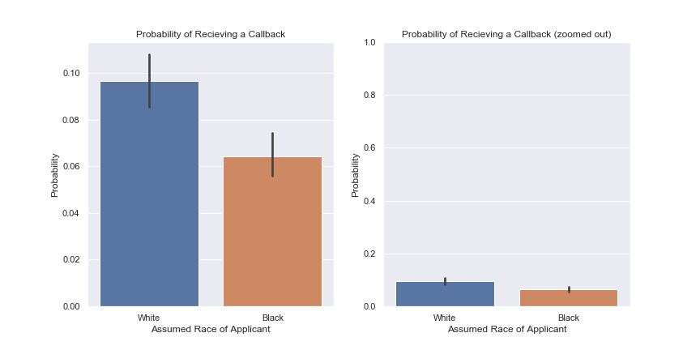
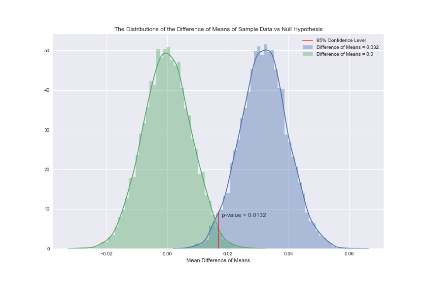

### What test is appropriate for this problem? Does CLT apply?

The variable that we will be testing is whether or not the applicant got a call back. Since this variable can be coded as a success (callback = 1) or failure (no callback = 0), this is an example of a Bernoulli Trial. To examine the potential presence of racial discrimination, we will use two-sample inference (black-sounding names vs white-sounding names).
 

The central limit theorem will apply because the following assumptions are met:  
* Randomization Condition: The race identifier was randomly assigned during the screening process, so the qualification of applicants should be randomly distributed as well.
* Independence Assumption: No applicant should appear in both groups and the presence of one applicant should not have an effect on the following applicants.
* 10% Condition: Our sample size is much smaller than 10% of all job applicants. This also lends evidence to meeting the independence assumption
* Sample Size Assumption: Both sample groups are much larger than 30, so we can assume that our sample size will be large enough.

Since we are using a Bernoulli distribution, the central tendency will group around the probability that the group will receive a callback.

### What are the null and alternate hypotheses?

**H0**: There is no racial discrimination in the number of callbacks for applicants (i.e. there is no difference in the probability of a black applicant getting a callback than a white applicant.)

**HA**: There is racial discrimination in the number of callback for applicants.

**Significance Level (&alpha;)**: 0.05

First, we calculate the sample mean of getting a callback for the entire sample and then broken down into our two groups (black / white applicants). We get a sample mean probability of 0.080 for getting a callback. Among White applicants, the probability climbs to 0.097, while Black applicants drop to 0.064. This gives us a sample difference of means of 0.032 with a standard error of 0.0078.

We then use standard frequentist statistics to calculate the p-value of seeing a difference of means as extreme as 0.032 assuming the null hypothesis. We calculate the 95% confidence interval for our difference of means to be between 0.01675 and 0.04731. We can already see that this does not include a difference of 0.0, but we will go ahead and calculate our z-score and p-value. These are 4.1084 and 0.0000398 respectively. This is well below our &alpha; of 0.05, so we can reject the null hypothesis. However, we will also compute a bootstrap analysis in order to gain greater insight into what the true population statistic may look like.

We calculate the following 95% confidence intervals for the bootstrap sample difference of mean and difference of mean assuming the null hypothesis. These are as follows:

| Bootstrap Type                    | 95% Confidence Interval |
| --------------------------------- | ----------------------- |
| Sample Difference of 0.032        | (0.00300, 0.06125)      |
| Null Hypothesis Difference of 0.0 | (-0.02891, 0.02890)     |

The bootstrap analysis gives us a larger p-value at 0.0152, but still small enough to reject the null hypothesis. You can see a visualization of the bootstrap analysis below:

## Closing Remarks
To restate, our null hypothesis is that their is no racial discrimination in the amount of callbacks received during the initial application process. To test this, we assumed that the probability of a White applicant receiving a callback is equal to that of a Black applicant (p&#770;1 - p&#770;2 = 0). We set our significance level at 0.05.

Using frequentist methods of analysis, we see that our sample difference of probability (0.032) has a p-value of 0.0018. In other words, if we assume the nul hypothesis to be true, then we would expect to see a difference this large less than 0.2% of the time. If we perform a boostrap analysis, generating 10,000 sample probabilities, we get a p-value of 0.0132. Although this is much higher than our sample p-value, both are well below our significance level of 0.05, so we reject the null hypothesis and state that there is significant evidence to suggest that their may be racial discrimination in the callback process.

Although our analysis suggests that the racial assumptions about names are an important factor in the callback success, we do not yet have sufficient analysis to determine whether this is the most important factor. Because the names were randomized, we can assume that the other variables did not play a role in the callback success rate, but to be more certain we would need to perform multivariate analysis. 