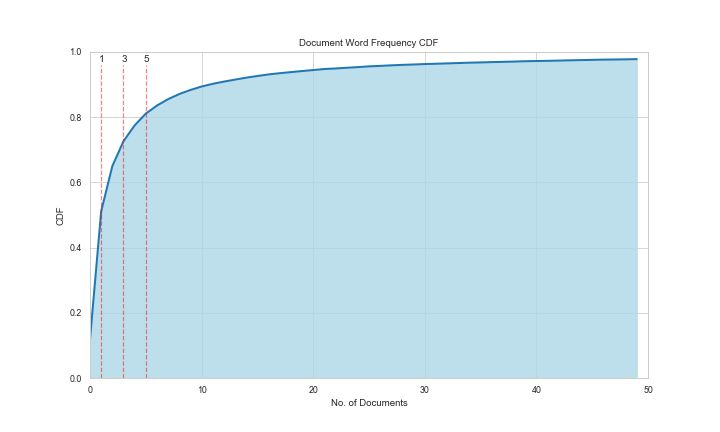
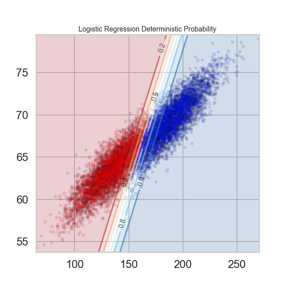
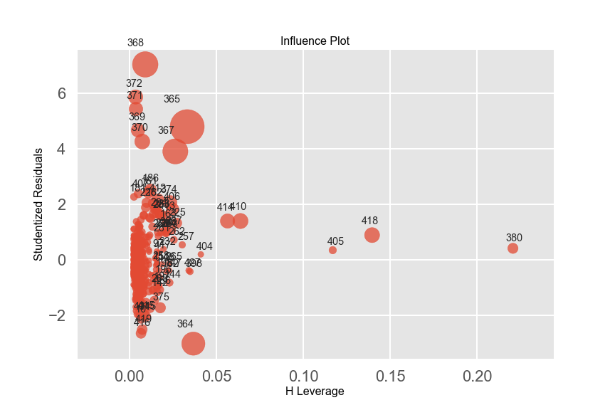
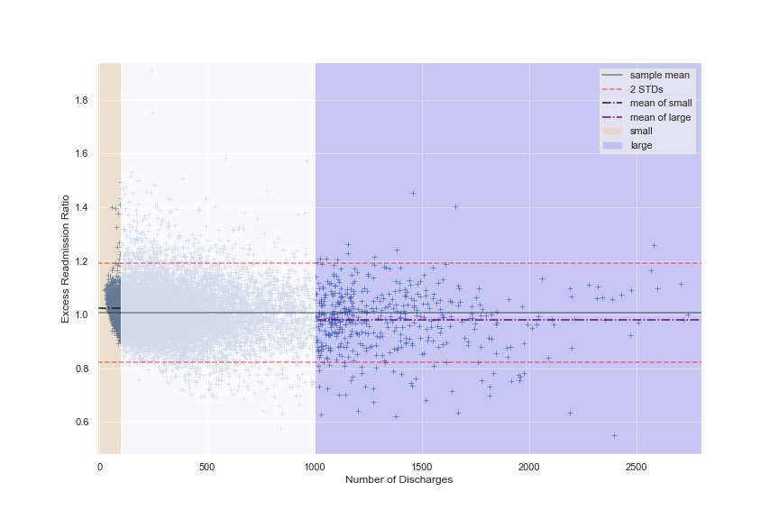

# Springboard Data Science Bootcamp
This repository houses the projects completed during my time in [Springboard's Data Science Career Track Bootcamp](https://www.springboard.com/workshops/data-science-career-track). Below is a list of projects with descriptions and links.

## Capstone 1: [Predicting the Hyper-local Prevalence of Chronic Kidney Disease](predicting_chronic_disease)
Chronic kidney disease (CKD) has been on the rise in recent years and is a major cause of mortality and health expenditure in the United States. This project uses 235 features extracted from the U.S. Census Bureau API to test whether hyper-local rates of CKD can be determined using readily available demographic data. These features include data on age, sex, marital status, disability, employment, profession, household type, housing costs, and type of insurance. Regression and ensemble methods were used to predict rates of chronic kidney disease. Ultimately, stochastic gradient boosting proved to be the best model with a predictive accuracy of 83.94%.

## Capstone 2

## Mini-projects
### [Predicting Moving Ratings with Naive Bayes](naive_bayes)

This project achieved 77% accuracy in predicting movie ratings from Rotten Tomatoes text reviews using a Term Frequency - Inverse Document Frequency vectorizer and a Multinomial Naive Bayes classifier.

**Key Skills**

* Natural Language Processing with Naive Bayes and TF-IDF vectorization
* Grid search cross-validation  and visualization for hyper-parameter tuning
* Evaluate classification errors using a confusion matrix

### [Customer Segmentation with Unsupervised Learning](clustering)

Using one dataset detailing marketing email campaigns and another with customer sales data, we are tasked with segmenting the customer base to gain insight into customer behavior in an attempt to better tailor future marketing campaigns.

**Key Skills**

* use `scikit-learn` to implement clustering
    * K-means
    * Affinity Propagation
    * Spectral Clustering
    * Agglomerative Clustering
    * DBSCAN
* evaluate clustering with unsupervised metrics
    * Silhouette Score
    * Calinski-Harabaz Score
    * Gap Statistic
* visualize clustering with PCA dimension reduction and tSNE

### [Using Logistic Regression to Determine Sex based on Height and Weight](logistic_regression)
This was a quick project focusing on the mathematics of logistic regression and used `scikit-learn` for implementation. Grid search was used to improve the model through hyperparameter tuning.

**Key Skills**

* use `scikit-learn` to implement logistic regression model
* use `GridSearchCV` to optimize hyperparameter tuning
* gain visual understanding of logistic regression model using plots

### [Predicting Housing Prices with Linear Regression](linear_regression)
Using the Boston Housing Data Set, this mini-project applies linear regression using the `statsmodels` and `scikit-learn` libraries to create and compare predictive models. 

**Key Skills**

* linear regression (univariate and multivariate)
* model interpretation
* model evaluation with sum-of-squares, R2, mean squared error, and F-statistic
* fine-tuning models using influence and residual plots
* comparing models with F-statistic and AIC

### [Reducing Hospital Readmission Rates](EDA_hospital_readmission)
This mini-project uses statistics and data visualization to analyze the potential efficacy of proposed measures for reducing excess readmission ratios for U.S. hospitals. 

**Key Skills**

* pairs bootstrap / frequentist statistical analysis
* hypothesis testing with difference of means, Pearson's r, and linear regression slopes
* data visualization using seaborn and matplotlib

### [Examining Racial Discrimination in the U.S. Job Market](EDA_racial_discrimination)
Using statistical analysis to determine if their is racial bias toward job applicants with White-sounding names.

**Key Skills**

* bootstrap / frequentists statistical analysis
* hypothesis testing with two-sample inference
* pandas | seaborn | matplotlib

### [Analyzing Human Body Temperature](EDA_human_temperature)
This mini-project focused on using statistical analysis to determine if 98.6oF is actually the average human body temperature.

**Key Skills**

* bootstrap / frequentists statistical analysis
* hypothesis testing with one-sample inference
* pandas | seaborn | matplotlib

### [Quandl Financial Data API](API)
Pull financial data from the Quandl API in order to calculate descriptive statistics.

**Key Skills**
* using `requests` library to access API
* descriptive statistics

### [SQL Mini-Project](sql_mini_project.sql)
This project entailed writing a SQL query script to pull data from a fictional facilities dataframe

**Key Skills**
* SQL / MySQL queries

### [Wrangling World Bank Data with JSON](data_wrangling_json)
Pull data from a JSON file into Python to generate descriptive statistics.

**Key Skills**
* reading JSON files directly into pandas
* descriptive statistics
* data visualization with pandas

## Interview Prep
These are series of questions that were given to us answer at the end of each unit.

**[Inferential Statistics](interview_prep/inferential_statistics.md)**: General questions about statistics and methods of hypothesis testing.

**[Data Wrangling](interview_prep/data_wrangling.md)**: Questions about using pandas and SQL for data wrangling.

**[Programming Boot-up](interview_prep/programming_boot-up.md)**: General questions about python data structures and standard libraries.

