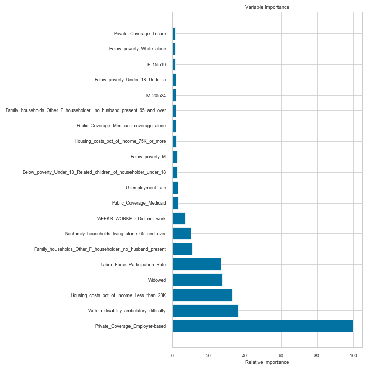
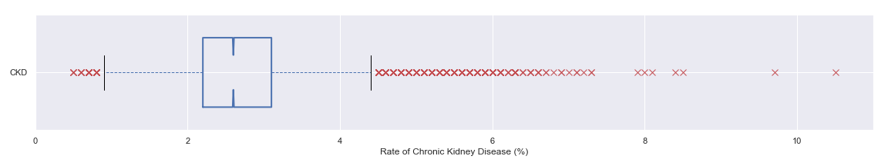
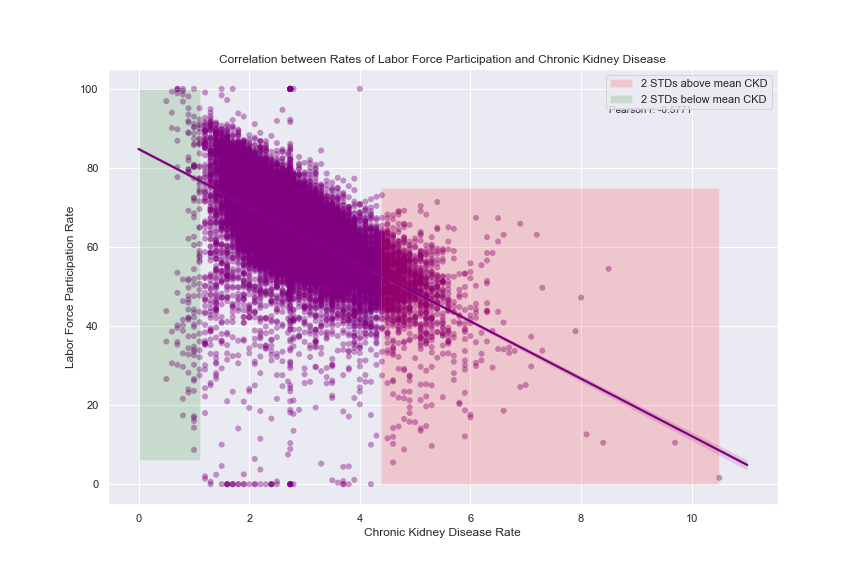
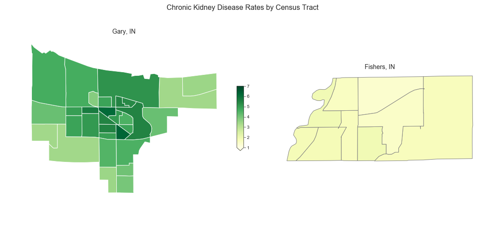
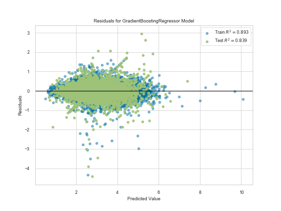
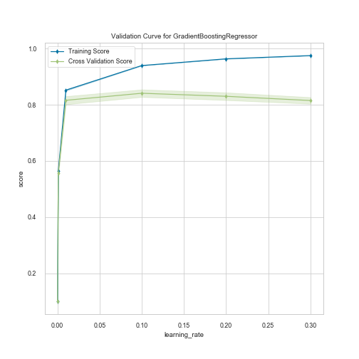

# Predicting the Hyper-local Prevalence of Chronic Kidney Disease
Chronic kidney disease (CKD) has been on the rise in recent years and is a major cause of mortality and health expenditure in the United States. This project uses 235 features extracted from the U.S. Census Bureau to test whether hyper-local rates of CKD can be determined using readily available demographic data. These features include data on age, sex, marital status, disability, employment, profession, household type, housing costs, and type of insurance. Regression and ensemble methods were used to predict rates of chronic kidney disease. Ultimately, gradient boosted decision trees proved to be the best prediction model with a predictive accuracy of 83.94% (adjusted R2).

The purpose of this project was to assist federal, state, and local public health agencies and organization to improve targeting of public health campaigns related to chronic kidney disease prevention. The predictive model helps to accomplish this goal by allowing limited resources to be targeted to neighborhoods with the greatest need for intervention.

**Data Sources**

* [500 Cities: Local Data for Better Health (Centers for Disease Control)](https://catalog.data.gov/dataset/500-cities-local-data-for-better-health-b32fd)
* [American Community Survey 5-year Data API (U.S. Census Bureau)](https://www.census.gov/data/developers/data-sets/acs-5year.html)

## Table of Contents

1. [Final Report](Capstone_1_Report.pdf): A summary of the project process, results, and actionable insights.
2. [Slide Deck](Predicting_CKD_slidedeck.pdf): Used for presenting findings
3. [Notebooks](notebooks): These were used in the following order to create the code base for this project.
   1. [Data Wrangling](notebooks/ckd_data_wrangling.ipynb): collecting, organizing, and cleaning datasets
   2. [Data Storytelling](notebooks/data_storytelling_chronic_disease.ipynb): using exploratory data analysis to tell a story about the data
   3. [Exploratory Data Analysis](notebooks/EDA_predicting_chronic_disease.ipynb): exploring the data for initial insights, correlations, and possibly important features
   4. [Regression Analysis](notebooks/regression_analysis_predicting_chronic_disease.ipynb): using various regression and ensemble methods to predict CKD prevalence
4. [Reports](reports): These reports were written to track progress and explain the process throughout the project.
   1. [Data Wrangling](reports/data_wrangling.md)
   2. [Exploratory Data Analysis](reports/EDA_report_predicting_ckd.md)
   3. [Milestone Report](reports/Capstone_1_Milestone_report.pdf)
   4. [In-Depth Analysis](reports/in-depth_analysis.md)
5. [Images](img): All saved plot and map outputs

